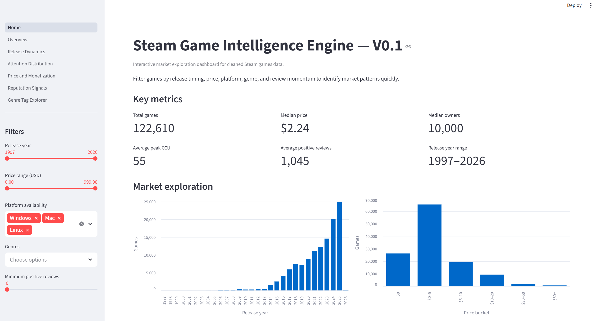
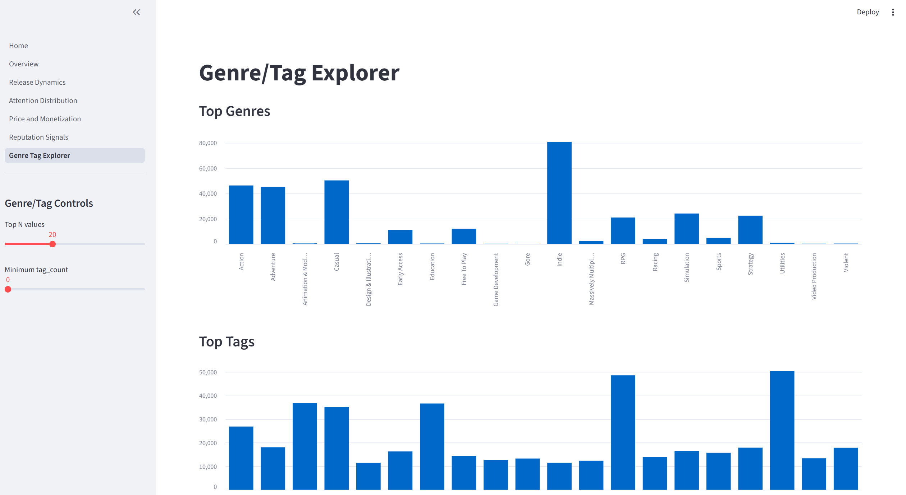
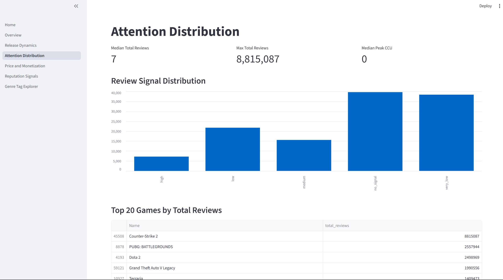

# Steam Game Intelligence Engine (V0.2 Market Intelligence)

## Project overview
Steam Game Intelligence Engine is a reproducible Steam game market intelligence project with data cleaning, analytical feature engineering, Streamlit dashboard pages, and a Markdown market insights report.

The project is currently in **V0.2 development**, focused on consistent descriptive analytics workflows and presentation-ready market exploration outputs.

## Feature summary
- **Cleaning pipeline:** standardized typing, platform flag normalization, and row-level hygiene checks.
- **Engineered analytics features:** release timing, owner-range parsing, review ratios/signals, price segmentation, and metadata density counters.
- **Validation layer:** script-based checks for schema completeness and key data-quality constraints.
- **Automated tests:** unit tests covering feature-engineering behavior and edge-case handling.
- **Dashboard modules:** multi-page Streamlit interface for release, pricing, reputation, and genre/tag exploration.

## V0.2 current feature summary
- **Analytical features:** `owners_mid`, `total_reviews`, `positive_rate`, `has_reviews`, `price_bucket`, `review_signal`, `review_sentiment`, `platform_count`
- **Market Insights dashboard page:** dedicated V0.2 page for filtered KPIs, distributions, ranking views, and heuristic candidate exploration (`app/pages/7_Market_Insights.py`)
- **Reproducible report generation workflow:** script-driven Markdown report build from processed data
- **Full processed-data report artifact:** `reports/steam_market_insights_v0.2.md`

## Repository structure
- `.github/workflows/` — CI workflow definitions.
- `app/` — Streamlit dashboard entrypoint and page modules.
- `data/raw/` — location for full raw datasets.
- `data/processed/` — generated cleaned/engineered outputs.
- `data/sample/` — reproducible sample datasets for demos and validation.
- `docs/` — project documentation and references.
- `notebooks/` — exploratory analysis notebooks.
- `reports/` — generated outputs and report artifacts.
- `scripts/` — operational CLI scripts for pipeline and validation.
- `src/steam_intelligence/` — core package logic.
- `tests/` — automated unit tests.

## Data usage and dataset placement
The included sample dataset is intended for reproducible demonstration and local validation:

- `data/sample/games_sample.csv`

For full-scale processing, place raw datasets under:

- `data/raw/`

Example conventional path:

- `data/raw/steam_games.csv`

## Quick start
### 1) Install dependencies
```bash
python -m pip install -r requirements.txt
```

### 2) Run pipeline with sample data
```bash
PYTHONPATH=src python scripts/run_pipeline.py --input data/sample/games_sample.csv --output data/processed/steam_games_cleaned.csv
```

### 3) Validate processed output
```bash
PYTHONPATH=src python scripts/validate_data.py --input data/processed/steam_games_cleaned.csv
```

### 4) Run tests
```bash
PYTHONPATH=src pytest -q
```

### 5) Launch dashboard
```bash
PYTHONPATH=src streamlit run app/Home.py
```

### PowerShell equivalents (Windows)
```powershell
# Set PYTHONPATH for current PowerShell session
$env:PYTHONPATH = "src"

# Run tests
python -m pytest -q

# Run validation
python .\scripts\validate_data.py --input .\data\processed\steam_games_cleaned.csv

# Generate the V0.2 market report
python .\scripts\generate_market_report.py --input .\data\processed\steam_games_cleaned.csv --output .\reports\steam_market_insights_v0.2.md

# Launch Streamlit
streamlit run .\app\Home.py
```

## Dashboard overview
V0.2 dashboard modules:

- `app/Home.py`
- `app/pages/1_Overview.py`
- `app/pages/2_Release_Dynamics.py`
- `app/pages/3_Attention_Distribution.py`
- `app/pages/4_Price_and_Monetization.py`
- `app/pages/5_Reputation_Signals.py`
- `app/pages/6_Genre_Tag_Explorer.py`
- `app/pages/7_Market_Insights.py`

These modules provide baseline market exploration views for pricing, release cadence, review activity, and genre/tag distribution.

## Market insights report
- V0.2 report artifact: [`reports/steam_market_insights_v0.2.md`](reports/steam_market_insights_v0.2.md)
- Generation input: `data/processed/steam_games_cleaned.csv`
- Method scope: descriptive metrics only (no causal inference, no machine learning predictions in the current report)

## Dashboard screenshots

### Home dashboard


### Attention distribution


### Genre and tag explorer


## Testing and CI
### Local testing
Use the same project commands for local validation:

```bash
PYTHONPATH=src python scripts/validate_data.py --input data/processed/steam_games_cleaned.csv
PYTHONPATH=src pytest -q
```

### Continuous Integration
GitHub Actions is configured to run repository checks on pushes and pull requests, including dependency installation and automated test/validation steps.

## Limitations
- `owners_mid` is an estimated midpoint of owner ranges, not exact sales.
- `positive_rate` is most meaningful for games with reviews.
- Hidden gems are heuristic candidates, not machine learning predictions.
- Current analysis is descriptive, not causal.

## Roadmap
- **V0.3 direction:** game segmentation.
- **V0.3 direction:** ranking score system.
- **V0.3 direction:** genre/tag opportunity analysis.
- **V0.3 direction:** predictive modeling later (after descriptive analytics baselines are stable).


## V0.2 development status
- V0.2 Step 1 delivered the analytical feature foundation.
- V0.2 Step 2 added a dedicated **Market Insights** Streamlit page for filtered KPI and market-structure analysis.
- V0.2 Step 3 added lightweight visualization polish for clearer filtering, KPI, chart, and ranking sections.
- V0.2 Step 4 added a reproducible Markdown Market Insights report generation workflow.
- V0.2 Step 5 improved dashboard consistency and readability.
- V0.2 Step 6 regenerated the full processed-data Market Insights report artifact.
- V0.2 Step 7 focuses on README and project presentation cleanup.

Generate the report with:
```bash
PYTHONPATH=src python scripts/generate_market_report.py --input data/processed/steam_games_cleaned.csv --output reports/steam_market_insights_v0.2.md
```
